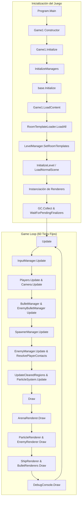
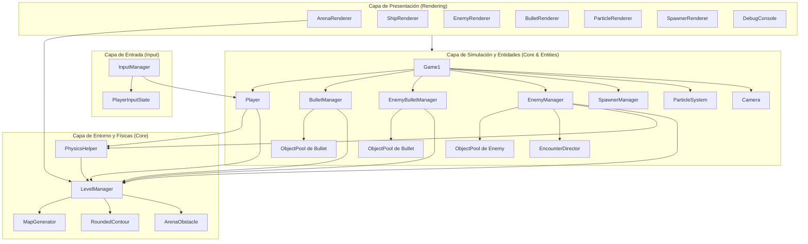
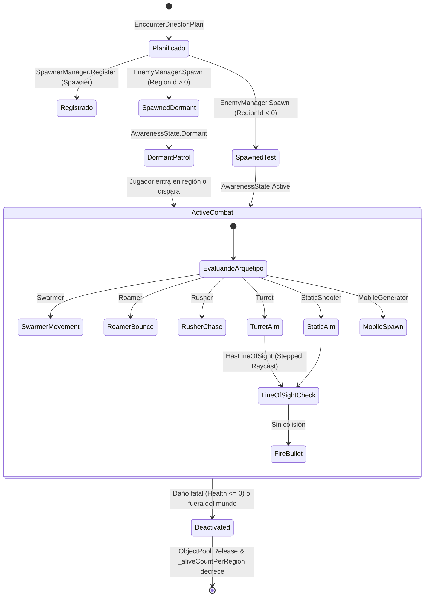

# Arquitectura del Sistema - Twin Stick Shooter

> **Última revisión:** 2026-10-01 / Fase 5+ (Optimización de ciclo de vida, IA de visión y arquitectura de entidades)

Documento de referencia técnica sobre la organización modular, ciclo de vida, estructuras de datos y principios de diseño del motor del juego.

---

## 1. Diagramas de Arquitectura (Mermaid)

### 1.1 Ciclo de Vida y Flujo del Game Loop



### 1.2 Arquitectura en Capas y Dependencias



### 1.3 Ciclo de Vida de Enemigos y Encuentros Regionales



---

## 2. Mapa Completo del Estado Actual (Árbol de Archivos)

Estructura exhaustiva de todos los módulos y archivos que conforman la solución:

```text
twin-stick shooter/
├── README.md                           # Guía de inicio, controles, requisitos y enlaces.
├── FOUNDATIONS.MD                      # Propósito del proyecto, alcance y directrices de cambio.
├── docs/
│   └── ARCHITECTURE.md                 # Especificación técnica, diagramas y mapa de código.
│
├── Game/                               # Proyecto principal (MonoGame DesktopGL / .NET 8)
│   ├── Program.cs                      # Punto de entrada (Main) e instanciación de Game1.
│   ├── Game1.cs                        # Orquestador del ciclo de vida, game loop, entrada y render.
│   ├── TwinStickShooter.csproj          # Configuración del proyecto, dependencias NuGet y copias de Content.
│   │
│   ├── Core/                           # Físicas, lógica de mapa, generación y utilidades
│   │   ├── ArenaObstacle.cs            # Estructura y lógica de obstáculos de arena destructibles/sólidos.
│   │   ├── ArenaObstacleDefinition.cs  # Definición y metadatos de obstáculos generados proceduralmente.
│   │   ├── Camera.cs                   # Cámara 2D con centro de masa multijugador, lerp y zoom dinámico.
│   │   ├── DebugConsole.cs             # Consola visual y panel de desarrollo dibujado mediante mini-fuente 5x7.
│   │   ├── EncounterDirector.cs        # Planificador determinista de grupos de enemigos por presupuesto regional.
│   │   ├── EnemyAwarenessState.cs      # Estados de alerta (Dormant, Active) para enemigos por salas.
│   │   ├── EnemyType.cs                # Enumerador de los 7 arquetipos de enemigos del juego.
│   │   ├── GameConstants.cs            # Constantes globales: dimensiones, velocidades, pools, timers y radios.
│   │   ├── GameState.cs                # Modos de juego (SinglePlayer, Multiplayer, GameOver, etc.).
│   │   ├── IPoolable.cs                # Contrato de reciclaje para entidades administradas por ObjectPool.
│   │   ├── LevelManager.cs             # Administrador de mapas, colisiones de grilla, primitivas y raycasts de visión.
│   │   ├── MapGenerationSettings.cs    # Parámetros configurables de generación procedural de mapas.
│   │   ├── MapGenerator.cs             # Generador procedural por crawlers, MST, colocación de salas y conexiones.
│   │   ├── MapLoader.cs                # Cargador directo de mapas desde archivos JSON estáticos.
│   │   ├── MapPrimitive.cs             # Primitivas geométricas (círculos, cápsulas, polígonos redondeados).
│   │   ├── MapRegionDefinition.cs      # Definición de regiones (Spawn, Corredor, Arena, Pocket) con presupuestos.
│   │   ├── MapZoneType.cs              # Tipificación de zonas de generación de terreno.
│   │   ├── ObjectPool.cs               # Pool genérico de alto rendimiento para reutilización sin garbage collection.
│   │   ├── PhysicsHelper.cs            # Resolución de movimiento con deslizamiento suave contra geometría compleja.
│   │   ├── RoomTemplateData.cs         # Modelo de datos para plantillas de sala deserializadas desde JSON.
│   │   ├── RoomTemplateLoader.cs       # Cargador de plantillas prediseñadas desde Content/RoomTemplates.
│   │   ├── RoundedContour.cs           # Algoritmos de contornos redondeados, offset de aristas y pruebas de penetración.
│   │   └── SpawnerManager.cs           # Administrador y ciclo de vida de generadores anclados al mapa.
│   │
│   ├── Entities/                       # Lógica de juego, simulación y pooling de entidades
│   │   ├── Player.cs                   # Nave del jugador, vida, escudo, invulnerabilidad y desaceleración por contacto.
│   │   ├── Bullet.cs                   # Datos y estado de proyectiles individuales (velocidad, rebotes, vida).
│   │   ├── BulletManager.cs            # Pool y simulación de proyectiles disparados por los jugadores.
│   │   ├── Enemy.cs                    # Entidad enemiga base con campos unificados para todos los arquetipos.
│   │   ├── EnemyManager.cs             # Pool de enemigos, máquina de estados por arquetipo y conteo O(1) regional.
│   │   ├── EnemyBulletManager.cs       # Pool y simulación de proyectiles hostiles disparados por torretas y tiradores.
│   │   └── ParticleSystem.cs           # Sistema de partículas puramente struct-based sin asignación en el heap.
│   │
│   ├── Input/                          # Abstracción de mandos y periféricos
│   │   ├── InputManager.cs             # Detección de mandos (hasta 4), teclado/mouse, deadzones radiales y buffers.
│   │   └── PlayerInputState.cs         # Estructura desacoplada con el estado de entrada snapshot de cada jugador.
│   │
│   ├── Rendering/                      # Subsistema de dibujo 2D basado en primitivas de MonoGame
│   │   ├── ArenaRenderer.cs            # Dibujo de la arena mediante mallas de triángulos y líneas de neón (VertexPositionColor).
│   │   ├── BulletRenderer.cs           # Renderizado de balas del jugador y proyectiles enemigos.
│   │   ├── EnemyRenderer.cs            # Renderizado vectorial de enemigos según su arquetipo geométrico y color.
│   │   ├── ParticleRenderer.cs         # Dibujo por lotes de partículas cuadradas mediante VertexPositionColor.
│   │   ├── ShipRenderer.cs             # Dibujo de naves de jugadores, vectores de dirección y campos de fuerza/escudo.
│   │   └── SpawnerRenderer.cs          # Dibujo de generadores estáticos con anillos de pulsación.
│   │
│   └── Content/                        # Recursos de datos (sin compilación MGCB obligatoria)
│       ├── Maps/
│       │   └── test_map.json           # Mapa estático de prueba para pruebas directas de carga.
│       └── RoomTemplates/
│           ├── room_large_arena.json   # Plantilla de sala grande para combates mayores.
│           ├── room_medium_ambush.json # Plantilla de emboscada con obstáculos.
│           ├── room_medium_pillars.json# Plantilla de sala mediana con pilares de cobertura.
│           └── room_small_trap.json    # Plantilla de trampa compacta para pasillos.
│
└── Game.Tests/                         # Suite de pruebas unitarias y de integración (xUnit)
    ├── Game.Tests.csproj               # Configuración del proyecto de pruebas.
    ├── CollisionRegressionTests.cs     # Pruebas de regresión sobre detección de colisiones de la grilla.
    ├── CollisionWorldTests.cs          # Pruebas de límites del mundo y contención de entidades.
    ├── EncounterDirectorTests.cs       # Pruebas de presupuestos y generación determinista de encuentros.
    ├── EnemyManagerTests.cs            # Pruebas de comportamiento de los 7 arquetipos de enemigos y conteo regional.
    ├── MapGeneratorCrawlerTests.cs     # Pruebas del generador por crawlers y conectividad de salas.
    ├── MapGeneratorTests.cs            # Pruebas de integración del pipeline de generación de mapas.
    ├── PhysicsHelperSlidingTests.cs    # Pruebas de deslizamiento físico contra paredes y esquinas.
    ├── PrimitiveDecompositionTests.cs  # Pruebas de descomposición de grillas en primitivas geométricas.
    ├── PrimitiveMapLifecycleTests.cs   # Pruebas de actualización y sincronización de revisiones del mapa.
    ├── RoomTemplateDataTests.cs        # Pruebas de serialización y lectura de plantillas JSON.
    ├── RoundedContourTests.cs          # Pruebas de cálculo de esquinas redondeadas y penetración.
    └── RoundedPrimitiveMapTests.cs     # Pruebas de renderizado y consistencia geométrica de primitivas.
```

---

## 3. Ideas Clave y Principios de Diseño

### 3.1 Política de Asignación Cero en el Game Loop (Zero-Allocation)
* **Object Pooling:** Tanto las balas del jugador (`BulletManager`), las balas enemigas (`EnemyBulletManager`), como los enemigos (`EnemyManager`) utilizan `ObjectPool<T>` respaldados por arrays contiguos de tamaño predeterminado (`GameConstants.MaxBullets`, `GameConstants.MaxEnemies`).
* **Partículas Struct-based:** `ParticleSystem` opera sobre un array contiguo de estructuras `Particle` por valor, evitando cualquier tipo de alocación o recolección por frame.
* **Conteo Regional O(1):** `EnemyManager` mantiene internamente un diccionario de contadores vivos por región (`_aliveCountPerRegion`), eliminando recorridos lineales sobre el pool en el game loop.

### 3.2 Geometría Orgánica vs. Grilla Rígida
* La simulación combina una base lógica en grilla (`_collisionGrid`) para operaciones de bajo costo con una representación geométrica primitiva (`MapCircle`, `MapCapsule`, `MapRoundedPoly`).
* Los contornos redondeados (`RoundedContour`) suavizan esquinas convexas y cóncavas para permitir que las entidades deslicen de forma natural mediante `PhysicsHelper.MoveWithCollision`.

### 3.3 IA y Raycast Optimizado
* Para evitar caídas drásticas de rendimiento con múltiples enemigos con ataque a distancia (`Turret`, `StaticShooter`), `LevelManager.HasLineOfSight` utiliza un raycast por pasos discretos ($16\text{ px}$) con evaluación geométrica de salida temprana (`return false` inmediato al detectar impacto), prescindiendo de barridos infinitesimales continuos y búsquedas binarias innecesarias.

### 3.4 Desacoplamiento entre Simulación y Renderizado
* Ningún renderer modifica el estado de la partida.
* La reconstrucción de mallas en `ArenaRenderer` responde a un número de revisión (`PrimitiveMapRevision`), ejecutándose únicamente cuando el mapa se carga o cuando un obstáculo destructible es efectivamente destruido, no en cada frame ni ante simples daños menores.

### 3.5 Ciclo de Vida MonoGame
* Todo acceso al sistema de archivos de disco (`RoomTemplateLoader.LoadAll`) y la generación procedural del mapa se ejecuta estrictamente dentro de `LoadContent()`.
* Al finalizar la carga, se fuerza una recolección completa (`GC.Collect()` y `GC.WaitForPendingFinalizers()`), garantizando que la memoria transitoria del arranque quede purgada antes de iniciar el ciclo de juego.
